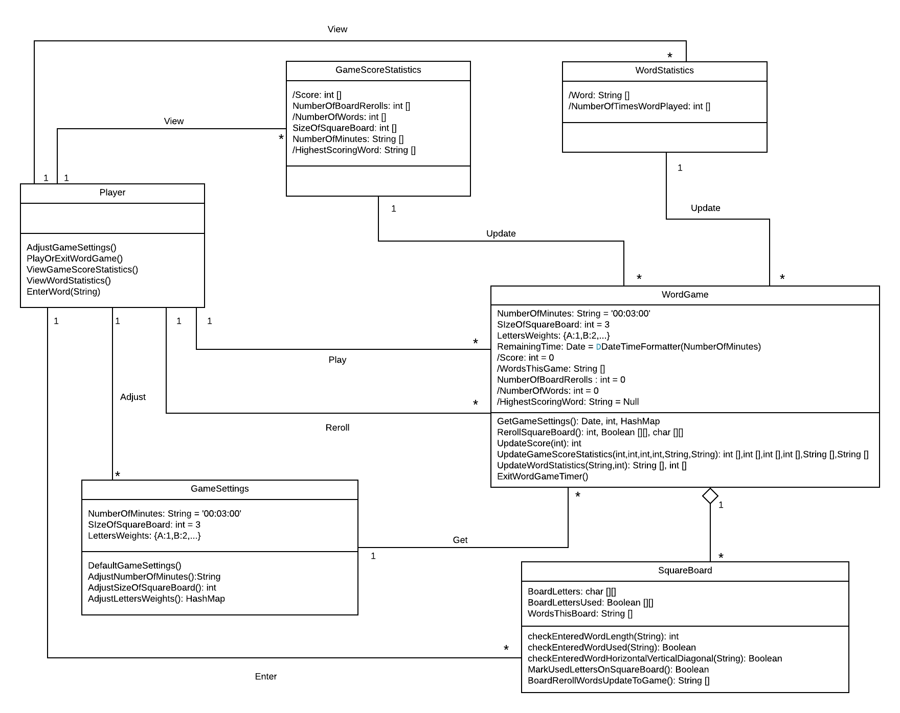

# Word Game Software Design Group Discussion

### a. Individual designs

Design 1: Shouyi Zhang (szhang651)

* pros
  * Lot of compositions used - which make sense in a way (i.e. if a Player is removed, then the Game should also be removed)
  * I like the Game class being treated as a controller for the GameActivity class
  * So far it seems we all agree that the board should be a 2D array in Java :)
  * displayRemainingTime(), isValidAction(), The function 'calculatePoints()' will be called at the end of each loop of the game (I like the calculation of the score on the fly method)
  * I like the box next to SettingsActivity which defined the range of each attribute.
  * I like the goBackToMainMenu() function in Game/Settings/Statistics.
  * The stopManually() function allowed player to exit the game before time count to zero.

* cons
  * I think it’s specific for Android, but we may want something more general for our UML diagram
  * I like the separate Settings class, but is there a way we can use that class in other classes so that we don’t duplicate information (e.g. boardSize)?
  * How to ensure ordering of statistics?
  * The class names doesn't seem very intuitive.
  * The Game class looks a little strange to me. The player doesn't need to start the game to view statistics. Maybe the class name should be changed to MainMenu. The play relationship between Player and Game should be changed into start app.
  * There should be a Board class.
  * There should be more operations in Player class.
  * The derive attributes are not labled.
  * Not all the relationships are defined (lines connecting classes), for example, the player can "View" statistics, "Adjust" settings, "Reroll" board.
  * There seems to be some mistakes in the 1 to 1, 1 to n, n to n relationships.
  * What does the start() function in SettingsActivity do?

Design 2: Ying Yu (yyu413)
* pros
  * Straightforward (my design was a little convoluted), which might be a good thing if we are overthinking this project (which may likely be the case lol)
  * I have similar relationships of board, setting, game!
  * Re: stats - “a File containing desginated file that contains all the information stored previously”. May be quicker to look through a file than making a call to some DB. This would be awesome to persist the player’s stats across multiple sessions.
  * The graph looks much cleaner than mine.
  * I like how the Board has a single attribute settings, which can include all the game settings info, so there is not too many duplicate attribute in all the classes.
  * Makes `Board` as a single class is a good point. We can move all the board related atrributes and mothods to the class `Board`. This design follows the SOLID principles of object-oriented programming. In terms of S in [SOLID](https://en.wikipedia.org/wiki/SOLID), it means that "A class should only have a single responsibility, that is, only changes to one part of the software's specification should be able to affect the specification of the class".
  * There is a attribute `file: File` in both class `Score_Statistics` and `Word_Statictics`. Using file to store information is a good way to persistent data.

* cons
  * “The Board field will be updated while the game goes.” How so?
  * We may need a little more logic handled in these classes instead of from the GUI
  * Maybe there should be a Player class, because this is a very important to the game. There is many important operations/relationships related to Player, which are not shown here.
  * There should be relationships lables, such as 1 to n.
  * The derive attributes are not labled.
  * The data type of time, max_Time should probably not be float.
  * Function update_Score_stats() and update_Word_stats() should be in Play_Game.
  * All the `set` and `get` methods are no need to incleded in the UML diagram.
  * The variable name usually has two types of formatting: `lowerCamelCase` or `underscore_case`. The class name is in `UpperCamelCase`.
  * When reprent an operation in UML diagram. we usually follow this formatting: `+ operation1(params):returnType`.

Design 3: Lily Fang (qfang9)

* pros
  * We have a lot of similar classes! (I think this is a pro)
  * I like DefaultGameSettings() on the GameSettings class
  * I like the validation methods on the SquareBoard class (specifically, I think CheckEnteredWordHOrizontalVerticalDiagnal() would be good for performance)
  * I like the update methods on the WordGame class (I had my update methods in my Player class for some reason). Maybe we can put the update methods as part of a teardown() method in WordGame?
  * Makes `Board` as a single class is a good point. We can move all the board related atrributes and mothods to the class `Board`. This design follows the SOLID principles of object-oriented programming. In terms of S in [SOLID](https://en.wikipedia.org/wiki/SOLID), it means that "A class should only have a single responsibility, that is, only changes to one part of the software's specification should be able to affect the specification of the class".
  * There is a attribute `file: File` in both class `Score_Statistics` and `Word_Statictics`. Using file to store information is a good way to persistent data.

* cons
  * Same information is spread across several classes -  I think we can condense this so that information has one source of truth (ex. NumberOfMinutes is in WordGame and GameSettings) 
  * Should re-roll be an association between Player and SquareBoard?
  * Derived attributes on the Stats classes may be slow if we have a lot of games to parse through. Implementation specific, but we can use some kind of ordered collection - maybe a heap/priority queue?
  * There seems to be some mistakes in the 1 to 1, 1 to n, n to n relationships.
  * The attributes and functions are note defined as public/private.
  * Since the class `Player` has to interact with classes `WordGame`, `GameSettings`, `GameScoreStatistics`, and `WordStatistics`. It would be better that include a attribute of each class.
  * It would be better that let lines have direction, such as `→` .
  * It would be better add `+` or `-` in front of a attribute and function to indicate if it is `private` or `public`.

Design 4: Kevin Gaan (kgaan3)
* pros
  * Tried to make it language agnostic
  * Class names are intuitive.
  * Class included all the nouns in the requirement, which makes the design very comprehensive.
  * The GameSettings included vowelProportion and resetPenalty attributes, this makes the software more flexible.
  * The ultility class in this graph is important.
  * Make `SquareBoard` as a single class is a good point. We can simplify the class `WordGame` and move all the board related attribute and method to the class `SquareBoard`.
  * All the method in the class `Player` are intuitive, which makes the Player has meaning to exist.

* cons
  * Same information is spread across several classes -  I think we can condense this so that information has one source of truth (ex. NumberOfMinutes is in WordGame and GameSettings) 
  * Should re-roll be an association between Player and SquareBoard?
  * Derived attributes on the Stats classes may be slow if we have a lot of games to parse through. Implementation specific, but we can use some kind of ordered collection - maybe a heap/priority queue?
  * Is it necessary to have a startDate in Statistics?
  * settings, gameScoreStats and wordStats doesn't seem to be attribute of Player.
  * Should we add functions such as adjustBoardSize() to GameSettings?
  * Function updateGameScoreStats() and updateWordStats() should be in the WordGame instead of Player.
  * The letters positions are not defined as an attribute in GameBoard.
  * There should be a line connecting Word and GameBoard, since the word entered should be checked against the Board; Is getSurrondingLetters() used to check the letters in the word is connected horizontal, vertical or diagnal.
  * There should an attribute in GameBaord, which records if the letter on the GameBoard has already been used by previous words entered.
  * Should there be a reroll relationshiop between Player and WordGame, since it is the player that chooses to reroll the board.
  * Should there be a enterword relationshiop between Player and Word, since it is the player that enters word based on the board.
  * Since the class `Player` has to interact with classes `WordGame`, `GameSettings`, `GameScoreStatistics`, and `WordStatistics`. It would be better that include a attribute of each class.
  * It would be better that let lines have direction, such as `→` .
  * It would be better add `+` or `-` in front of a attribute and function to indicate if it is `private` or `public`.

### b. Team design
### c. Summary

