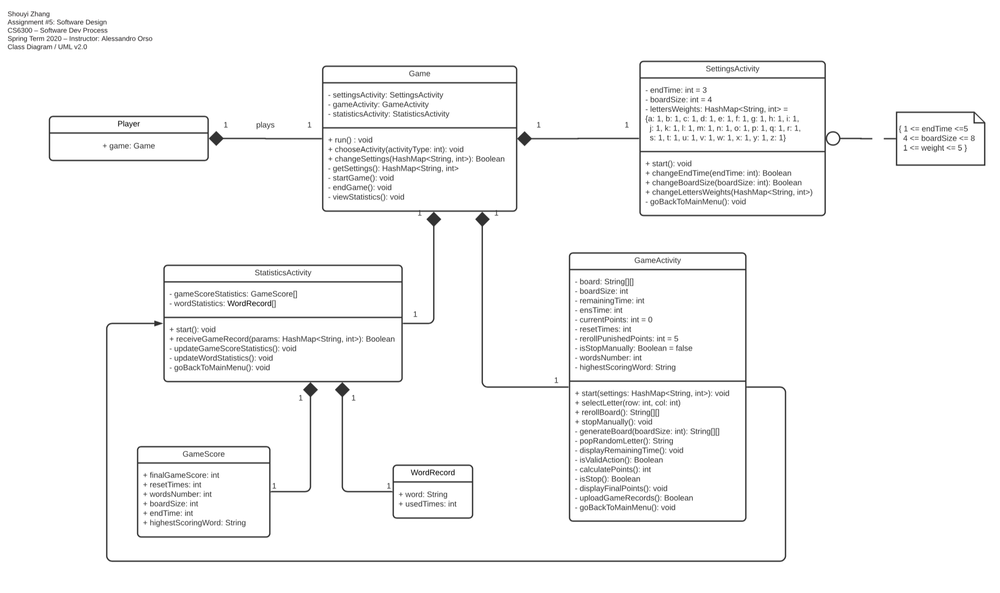
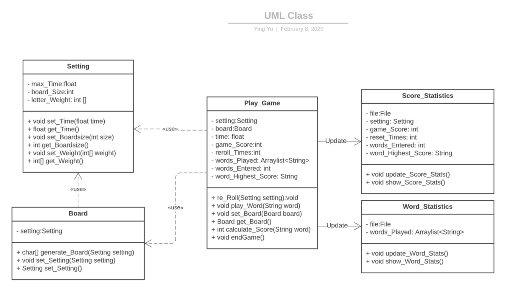
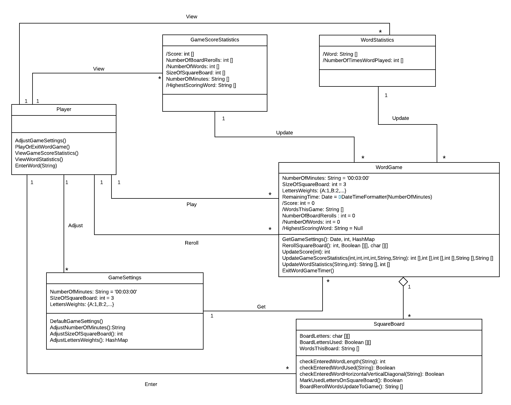
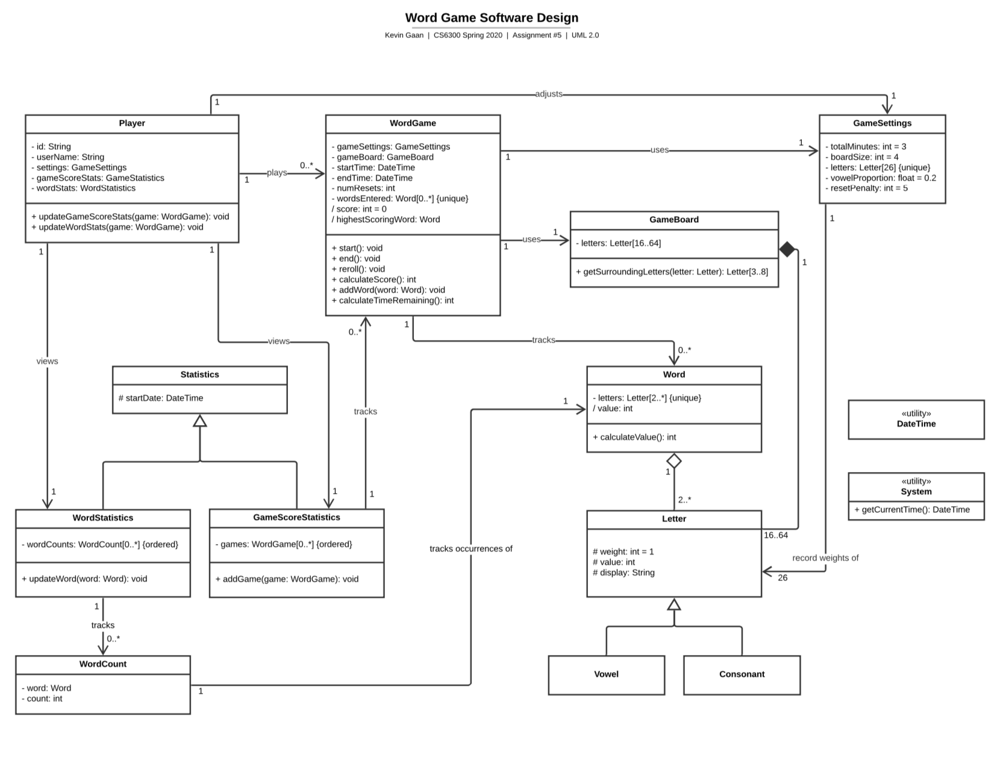
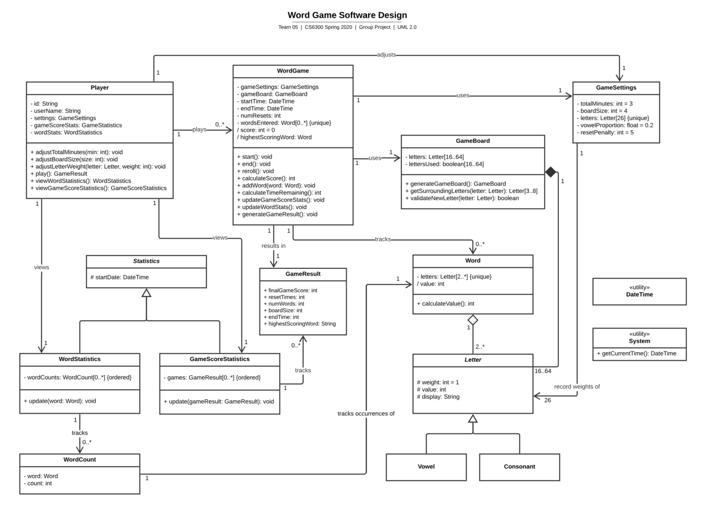

# Word Game Software Design Group Discussion

---
## A. Individual Designs

### Design 1: Shouyi Zhang (szhang651)

_Pros_
  * Lot of compositions used - which make sense in a way (i.e. if a `Player` is removed, then the `Game` should also be removed).
  * It's good `Game` class being treated as a controller for the `GameActivity` class.
  * ??? `displayRemainingTime()`, `isValidAction()`, The function `calculatePoints()` will be called at the end of each loop of the game (I like the calculation of the score on the fly method).
  * The box next to `SettingsActivity` defined the range of each attribute.
  * `goBackToMainMenu()` function allows player to go back to MainMenu in Game/Settings/Statistics.
  * The `stopManually()` function allows player to exit the game before time count to zero.

_Cons_
  * It’s specific for Android, but we may want something more general for our UML diagram.
  * The separate `Settings` class is nice, but is there a way we can use that class in other classes so that we don’t duplicate information (e.g. `boardSize`)?
  * How to ensure ordering of statistics is not in descriped.
  * The class names doesn't seem very intuitive.
  * The `Game` class looks a little strange. The `Player` doesn't need to start the game to view statistics. Maybe the class name should be changed to MainMenu.
  * There probably should be a `Board` class.
  * There should be more operations in `Player` class.
  * The derive attributes are not labled.
  * Not all the relationships are defined (lines connecting classes), for example, the player can "View" statistics, "Adjust" settings, "Reroll" board.
  * There seems to be some mistakes in the 1 to 1, 1 to n, n to n relationships.
  * What does the `start()` function in `SettingsActivity` do?
  * If `Player` is defined as a class, it better has some attributes and method. 
  * ??? `GameScore` and `WordRecord` should have connection with `GameActicity`, why not put these two class into `GameActivity` since they have only fields without any methods.

---

### Design 2: Ying Yu (yyu413)

_Pros_
  * Straightforward (Kevin's design was a little convoluted), which might be a good thing if we are overthinking this project (which may likely be the case)
  * Have similar relationships of `Board`, `Setting`, `Game` to Kevin and Lily's design.
  * Re: stats - “a File containing desginated file that contains all the information stored previously”. May be quicker to look through a file than making a call to some DB. This would be awesome to persist the player’s stats across multiple sessions.
  * `Board` class has a single attribute settings, which can include all the game settings info, so there is not too many duplicate attribute in all the classes.
  * Makes `Board` as a single class is a good point. We can move all the board related atrributes and mothods to the class `Board`. This design follows the SOLID principles of object-oriented programming. In terms of S in [SOLID](https://en.wikipedia.org/wiki/SOLID), it means that "A class should only have a single responsibility, that is, only changes to one part of the software's specification should be able to affect the specification of the class".
  * There is a attribute `file: File` in both class `Score_Statistics` and `Word_Statictics`. Using file to store information is a good way to persistent data.

_Cons_
  * It says “The Board field will be updated while the game goes.” How so?
  * We may need a little more logic handled in these classes instead of from the GUI.
  * Maybe there should be a `Player` class, because this is a very important to the game. There is many important operations/relationships related to `Player`, which are not shown here.
  * There should be relationships lables, such as 1 to n.
  * The derive attributes are not labled.
  * The data type of `time`, `max_Time` should probably not be float.
  * Function `update_Score_stats()` and `update_Word_stats()` should be in `Play_Game`.
  * All the `set` and `get` methods are no need to included in the UML diagram.
  * The variable name usually has two types of formatting: `lowerCamelCase` or `underscore_case`. The class name is in `UpperCamelCase`.
  * When reprent an operation in UML diagram. we usually follow this formatting: `+ operation1(params):returnType`.
  * The naming convention of class names is inappropriate.
  * Can be more detailed.

---

### Design 3: Lily Fang (qfang9)

_Pros_
  * The classes are very similar to Kevin's design.
  * `DefaultGameSettings()` on the `GameSettings` class is nice.
  * The validation methods on the `SquareBoard` class (specifically, `CheckEnteredWordHOrizontalVerticalDiagnal()` would be good for performance) is nice.
  * It make sense to put the update methods on the `WordGame` class (Kevin had update methods in `Player` class for some reason). Maybe we can put the update methods as part of a teardown() method in `WordGame`.
  * Makes `Board` as a single class is a good point. We can move all the board related atrributes and mothods to the class `Board`. This design follows the SOLID principles of object-oriented programming. In terms of S in [SOLID](https://en.wikipedia.org/wiki/SOLID), it means that "A class should only have a single responsibility, that is, only changes to one part of the software's specification should be able to affect the 
  * Well structured and detail oriented
  * The `WordStatistics()` and `GameScoreStatistics()` is used to track the data.
  * The `GameSetting()` class indicates the game rule clearly.
  * The operations in `PLayer` class should make the flow work better.

_Cons_
  * Same information is spread across several classes -  we can condense this so that information has one source of truth (ex. `NumberOfMinutes` is in `WordGame` and `GameSettings`) 
  * Should `Reroll` be an association between `Player` and `SquareBoard`?
  * Derived attributes on the Stats classes may be slow if we have a lot of games to parse through. Implementation specific, but we can use some kind of ordered collection - maybe a heap/priority queue?
  * There seems to be some mistakes in the 1 to 1, 1 to n, n to n relationships.
  * ??? Since the class `Player` has to interact with classes `WordGame`, `GameSettings`, `GameScoreStatistics`, and `WordStatistics`. It would be better that include a attribute of each class.
  * It would be better that let lines have direction, such as `→` .
  * It would be better add `+` or `-` in front of a attribute and function to indicate if it is `private` or `public`.
  * The role of `Player` is a little bit confusing regarding the `EnterWord()` method, and `Reroll()`, why `Reroll()` is defined in `WordGame` class while `EnterWord(String)` is defined in `Player`? They are similar behaviors。

---

### Design 4: Kevin Gaan (kgaan3)

_Pros_
  * Tried to make it language agnostic.
  * Class names are intuitive.
  * Class included all the nouns in the requirement, which makes the design very comprehensive.
  * The `GameSettings` included `vowelProportion` and `resetPenalty` attributes, this makes the software more flexible.
  * The ultility class in this graph is great.
  * Make `SquareBoard` as a single class is a good point. We can simplify the class `WordGame` and move all the board related attribute and method to the class `SquareBoard`.
  * All the method in the class `Player` are intuitive, which makes the Player has meaning to exist.
  * Very detailed and well structured.
  * `WordStatistics()` and `GameStatistics()` classes can separate the jobs to count scores.

_Cons_
  * Derived attributes on the Stats classes may be slow if we have a lot of games to parse through. Implementation specific, but we can use some kind of ordered collection - maybe a heap/priority queue?
  * Is it necessary to have a startDate in Statistics?
  * Should we add functions such as `adjustBoardSize()` to `GameSettings`?
  * Function `updateGameScoreStats()` and `updateWordStats()` should be in the `WordGame` instead of `Player`.
  * The letters positions are not defined as an attribute in `GameBoard`.
  * Is `getSurrondingLetters()` used to check the letters in the word is connected horizontal, vertical or diagnal? There should be a line connecting `Word` and `GameBoard`, since the word entered should be checked against the Board.
  * There should an attribute in `GameBaord`, which records if the letter on the GameBoard has already been used by previous words entered.
  * Should there be a `Reroll` relationshiop between `Player` and `WordGame`? Since it is the player that chooses to reroll the board.
  * Should there be a `Enterword` relationshiop between `Player` and `Word`? Since it is the player that enters word based on the board.
  * Since the class `Player` has to interact with classes `WordGame`, `GameSettings`, `GameScoreStatistics`, and `WordStatistics`. It would be better that include a attribute of each class.
  * Is there any method in `Player` and `Statistics` class that will be used to view or extract the data?
  * Do we need to define letter and word as separated classes?

---

### B. Team Design

After discussion, we decided to start with Kevin's design and improve it. 

In term of commonalities, we all had the following ideas:
1. We all have a class to represent **Player**. In our team design, the class named `Player`. The player can take several actions, such as play games, change settings, and review statistics. To complete these actions, `Player` should have the appropriate operations, such as `play()`, `viewWordStatistics()`, etc. Note that the player has access to instances of `GameSettings` and `Statistics` - and a new instance of `WordGame` can be created when the player plays a new game.
2. We all have a class to represent **Game**. In our team design, the class named `WordGame`. The class `WordGame` has all the attributes that related to the game, such as the current score of the game, the number of game resets, the entered words during the game and so on. The class `WordGame` also has the ability to generate a new game board (on `start()` or `reroll()`), calculate game score, and generate a game result, represented by the `GameResult` class.
3. We all have a class to represent **Settings**. In our design, the class named `GameSettings`. It indicates how we generate the game board. The class has several attributes: the size of the game board, the time limitation of the game, the weights of all letters. All of these attributes have their default value. We can access these attributes by `get` methods and update these attribute by `set` methods.
4. We all have a class to represent **GameStatistics**. In our design, the class named `GameScoreStatistics`. The attribute **games** in this class basically is an ordered array of `GameResult`. If the player wants to review all the game records, the player can access this attribute.
5. We all have a class to represent **WordStatistics**. In our design, the class named `WordStatistics`. The class contains all the words that have been played. Specifically, this class tracks instances of `WordCount`, and this class is essentially an ordered array of those word counts.

Comparing differences with other designs, the team design has many advantages:
1. The class `GameScoreStatistics` and `WordStatistics` inherited from the abstract class `Statistics`. This design conforms to the principle of object-oriented programming. Inheritance give us a chance to add different types of **Statistics** in the future.
2. The class `GameBoard` takes the responsibility to maintain the game board. The class `WordGame` just cares about organizing the whole game and doesn't have to worry about the implementation of generating a new board. This makes the definition of each class more clear and clean.
3. We added a new class `GameResult`. This class has all the information we need to display game scores. Also, this class helps us to manage information easily rather than keep all the attributes in the class `GameScoreStatistics`.
4. To fit design pattern, _for a given player_, we think the classes `Player`, `GameSettings`, `GameScoreStatistics` and `WordStatistics` should be **Singleton**.

---

### C. Summary
1. Methods to approach results
    * Individual design
    * Team meeting ( include peer review, team discuss, and collaborate)
    * Idea sharing
    * Come up with final design together

2. Things learned in terms of design
    * In terms of design, we learnt what is UML, which stands for Unified Modeling Language
    * Learnt OO analysis and practiced with design concepts. Learnt relationship between OO and UML
    * Learnt fundamental concepts of the object-oriented, such as Objects, Class, inheritance
    * Learnt about Class, Interface, Use Case, Component, nodes, behaviors, relationships, etc. concepts of UML
    * Real practice with the GameActivities and understand better of the concept

3. Benefit of Team work
    *  Fosters Creativity and Learning of each team members 
    *  Could solve problem more confident and efficiency 

